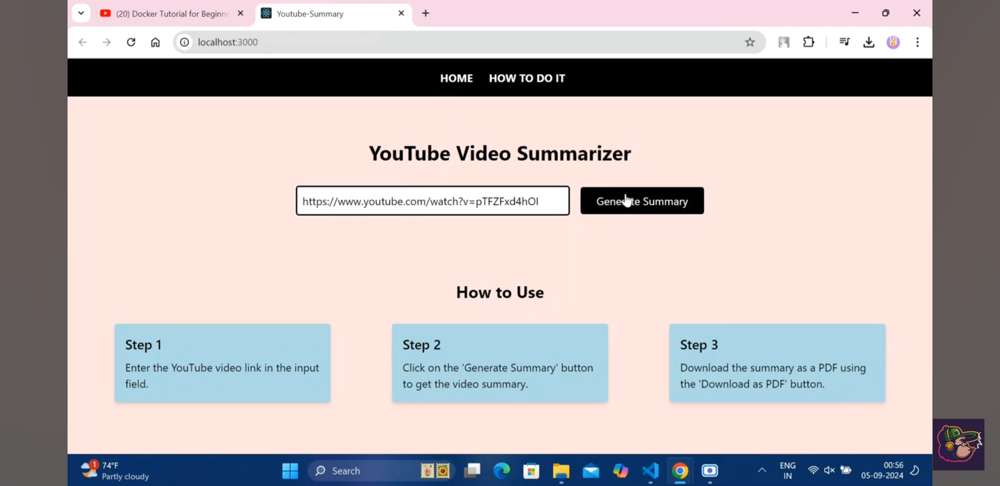
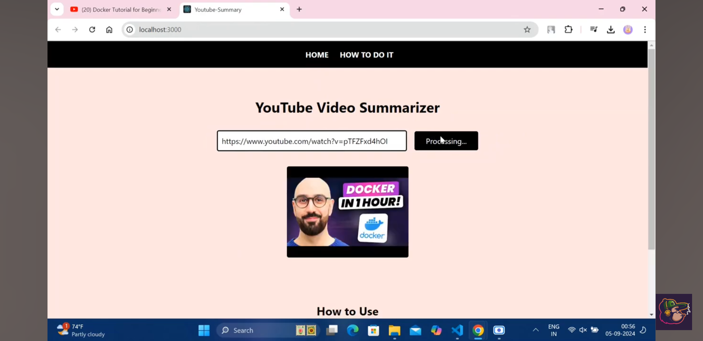
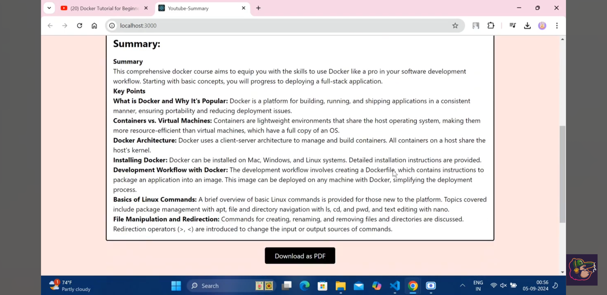

# YouTube Summary to PDF

A full-stack application that takes a YouTube video link, generates a summarized version of the video's transcript, and allows users to download the summary as a PDF. The application uses React for the frontend and Flask for the backend.


## Demo

[](https://youtu.be/sDAcp575n7I?si=Ya5wRnoWMqe4A7AM)

## Features

- **YouTube Transcript Extraction:** Automatically fetches the transcript of a YouTube video.
- **Summarization:** Summarizes the transcript into key points within 250 words.
- **PDF Download:** Allows the user to download the summary as a PDF.
- **Thumbnail Display:** Shows the thumbnail of the YouTube video being summarized.
- **Responsive Design:** The interface is designed to work well on both desktop and mobile devices.

## Tech Stack

- **Frontend:** React, TailwindCSS
- **Backend:** Flask, Python
- **External APIs:**
  - YouTube Transcript API
  - Google Gemini AI for content generation
- **PDF Generation:** FPDF

## Installation

### Clone the repository

```bash
git clone https://github.com/sounar97/Youtube-Summary-PDF.git
cd Youtube-Summary-PDF
```

### Backend Setup

1. Create a virtual environment:

    ```bash
    python3 -m venv venv
    source venv/bin/activate
    ```

2. Install the required packages:

    ```bash
    pip install -r requirements.txt
    ```

3. Create a `.env` file in the root directory and add your Google API Key:

    ```plaintext
    GOOGLE_API_KEY=your_google_api_key
    ```

4. Start the Flask server:

    ```bash
    python app.py
    ```

### Frontend Setup

1. Navigate to the frontend directory:

    ```bash
    cd frontend
    ```

2. Install the required packages:

    ```bash
    npm install
    ```

3. Start the React app:

    ```bash
    npm start
    ```

### Access the Application

- The frontend should be accessible at `http://localhost:3000`.
- The backend API is available at `http://localhost:5000`.

## Usage

1. Enter the YouTube video link in the input field.
2. Click the "Generate Summary" button to retrieve the summarized transcript.
3. Once the summary is generated, you can download it as a PDF.

## Screenshots






## Contributing

Feel free to submit issues or pull requests if you find any bugs or have new features you'd like to add.

